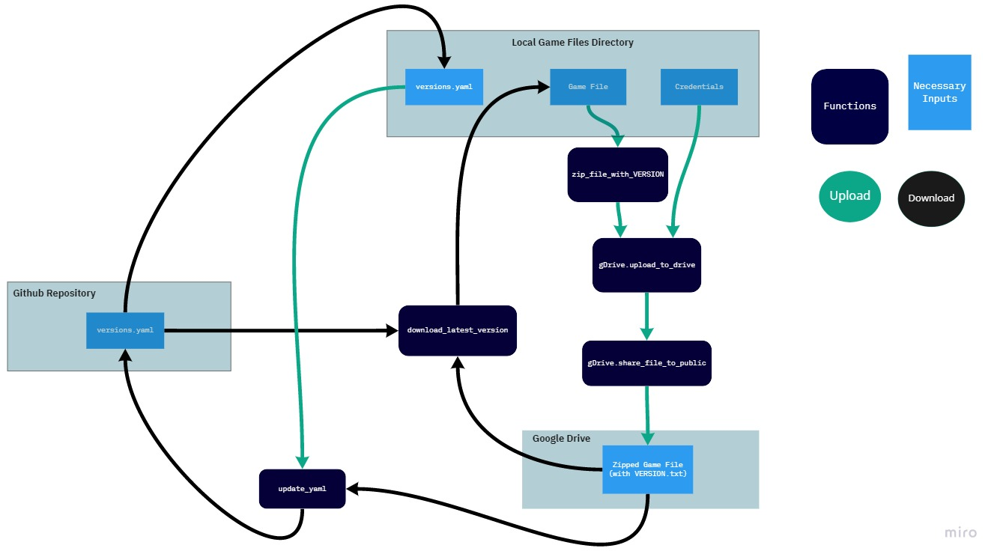

# Google Drive Game Patcher

## Description
This repository is a patcher for uploading, downloading, and unzipping google drive files, opening the drive files to public access, 
and keeping file versions updated. The code uses Python 3.7 (Pycharm IDE) with re, requests, os, yaml, pathlib, json, zipfile, and OAuth2Service modules installed.
(All dependencies listed in requirements.txt)

## Getting Started
I suggest creating a virtual environment by using your command line/shell to `cd` into the *googledrive_game_patcher* directory, and running the command `python -m venv venv`. 
I have included a *requirements.txt* file to easily install all dependencies. Navigate to the *Scripts* directory of the above/your venv, cut the included *requirements.txt* file
from the *googledrive_game_patcher* directory, and paste it in the *Scripts* directory. Then run the command `pip install -r requirements.txt` in your command line/shell.
Your environment setup should be ready to go.

All code is contained within the *patcher* directory, and as of now the patcher is completely functional.

Be sure you create Credentials detailed below in the Uploader Setup section, store your desired upload file in the *File_of_interest* directory, 
and change the raw github yaml url ("ver_URL") to yours at the top of *updater.py*'s **download_the_latest_version** and also *GDrive.py's* **delete_files_from_drive**.

*Main.py* now compresses the file you have in *File_of_interest* with a prompt for version number, uploads the zipfile with a *VERSION.txt* to drive,
opens this file for public access/sharing, updates the local *version_history.yaml* file and pushes this update to github.

A separate *download_latest_file.py* now downloads the latest version listed on your github's *version_history.yaml* from drive.

The *uploader.sh* and *downloader.sh* files have now been added and are functional; they run the *shell_file.py*'s which contain modified paths for *main.py* and *download_file.py*.
The command line window is left open to read, press enter to close it after they have run.

*GDrive.py*, *file_utils.py*, and *updater.py* are where all important functions are coded.

## Structure
- Google Drive + Drive API v3
- OAuth2 Playground
- Github Repository
- Local Storage with Game File + versions.yaml File

    

## Uploader Setup
In order to run the uploader portion of this code you will need to create a google account and access your google drive. 
You will also need to authorize credentials for a web application in the Google developers console and obtain a permanent refresh token from OAuth2Playground. 
Follow the links below to generate your account credentials.
 
- [Create Google Account](https://accounts.google.com/signup/v2/webcreateaccount?hl=en&flowName=GlifWebSignIn&flowEntry=SignUp)
- [Google Drive](https://drive.google.com/)
- Create Authorization Credentials [OAuth2 Authenication](https://developers.google.com/adwords/api/docs/guides/authentication)
- [Google Developers Console](https://console.developers.google.com/)

##### **IMPORTANT**
Be sure to rename the provided *Credentials_placeholder* directory to "Credentials" and the rename the existing *client_credentials_placeholder.json* file to "client_credentials.json".
The patcher functions depend on these specific credential file names for relative paths.

Once you have generated the Client Secret, Client ID, and refresh token credentials open the *client_credentials.json* file and enter/paste them into the labeled placeholder spots. 
Be sure to add the *Credentials* directory to your .gitignore (save patcher/Credentials/ in .gitignore) as this info grants access to your account.

## Downloader Setup
In order for the downloader to run appropriately you need a *VERSION.txt* file with the current file version number listed in it present in your *Game_Files* directory.
If you do not have a *VERSION.txt* it will automatically clear your *Game_files* directory and download the latest game files from Google Drive.

## Future Updates
Will update this readme if there are any future developments.
